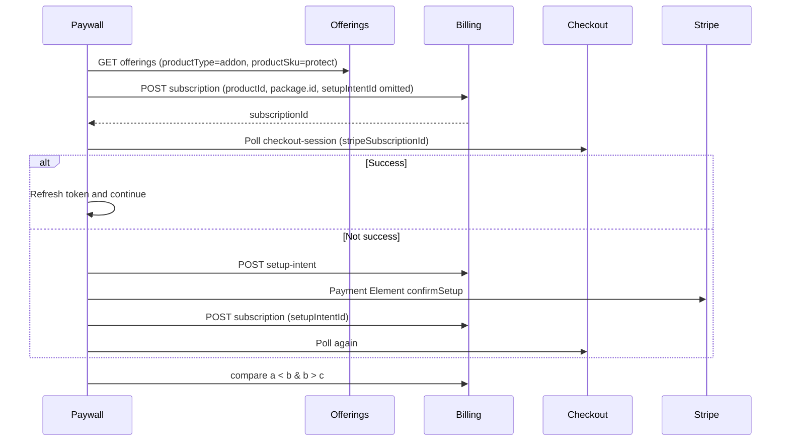

```mermaid
sequenceDiagram
  participant Paywall
  participant Offerings
  participant Billing
  participant Checkout
  participant Stripe

  Paywall->>Offerings: GET offerings (productType=addon, productSku=protect)
  Paywall->>Billing: POST subscription (productId, package.id, setupIntentId omitted)
  Billing-->>Paywall: subscriptionId
  Paywall->>Checkout: Poll checkout-session (stripeSubscriptionId)

  alt Success
    Paywall->>Paywall: Refresh token and continue
  else Not success
    Paywall->>Billing: POST setup-intent
    Paywall->>Stripe: Payment Element confirmSetup
    Paywall->>Billing: POST subscription (setupIntentId)
    Paywall->>Checkout: Poll again
  end
  Paywall->>Billing: compare a < b & b > c
```
