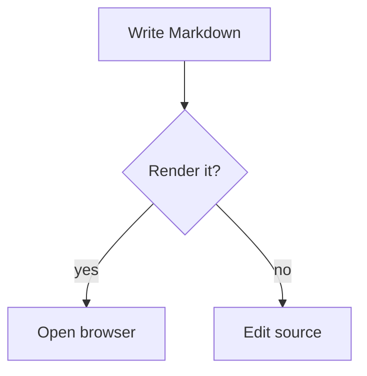
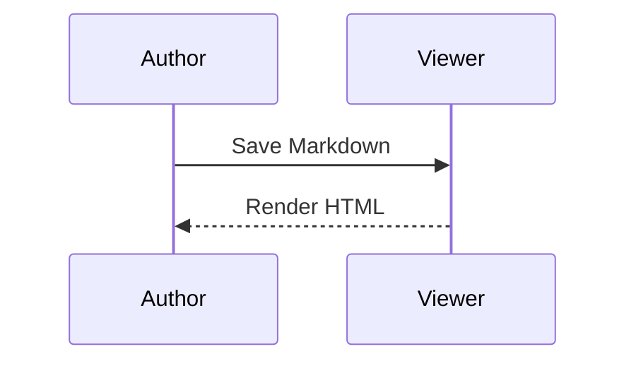

# Representative Markdown Preview

This paragraph contains *emphasis*, a [link](https://example.com), `inline code`,
Unicode text (café, 日本語, and emoji), and the duplicate phrase **same phrase**.
The same phrase appears again so future annotations cannot rely on text alone.

## Repeated Heading {#explicit-heading}

The explicit heading has a stable author-provided identifier.

## Repeated Heading

This heading receives an automatic identifier. It repeats text from the previous
section and includes **same phrase** once more.


## Lists and blocks

- [x] completed task
- [ ] pending task
  - nested child
  - another child with `code`

1. ordered item
2. second item
   1. nested ordered item

> A block quote with a [quoted link](https://example.com/quote).
>
> It spans more than one paragraph.

::: {.callout #fixture-callout}
This fenced div is a future-friendly component boundary.
:::

## Tables

| Name | Count | Status |
| :--- | ---: | :---: |
| alpha | 1 | ready |
| beta | 2 | waiting |

| Column one | Column two | Column three | Column four |
| --- | --- | --- | --- |
| A very wide value that deliberately exercises horizontal scrolling | Another long value that should stay in the table wrapper | More content for a wide table | Final wide cell |

## Mermaid diagrams





```mermaid {#invalid-diagram}
this is intentionally invalid Mermaid syntax
```

## Ordinary code

```sh
printf '%s\n' "ordinary fenced code remains code"
```

The following source HTML must be treated as text by the selected reader:
<span class="unsafe">raw HTML should not become a live element</span>
